<picture>
  <source media="(prefers-color-scheme: dark)" srcset="./dark.svg">
  <source media="(prefers-color-scheme: light)" srcset="./light.svg">
  
</picture>

<p align="center">
  <a href="https://parothegreat.site">Portfolio</a> ·
  <a href="https://github.com/parothegreat">GitHub</a> ·
  <a href="https://linkedin.com/in/moehammad-alvaro-pirata-prayogo-842a8834a">LinkedIn</a> ·
  <a href="mailto:alvaroprayogo38@gmail.com">Email</a>
</p>

## About

I build practical infrastructure systems, backend services, and internal tools across Linux, networking, monitoring, and security. My current work includes RFID access control, IT work-order workflows, Docker deployments, and Go-based automation.

```yaml
role: Junior Systems Administrator & Infrastructure Security Enthusiast
location: Cikarang Selatan, Indonesia
education: Industrial Electronic Engineering — SMK Mitra Industri MM2100
focus: Linux, networking, monitoring, backend tools, infrastructure security
```

## Selected Work

| Project | What it does | Stack |
| :-- | :-- | :-- |
| [RFID Access Control](https://github.com/teamitmivhs/rfid-access-control-system) | Institutional card validation, access logging, and server-room entry control. | `Go` `MariaDB` `REST API` |
| [work-order](https://github.com/teamitmivhs/work-order) | Searchable and trackable internal IT maintenance workflow. | `Go` `JavaScript` `MariaDB` |
| [go_http_checker](https://github.com/parothegreat/go_http_checker) | Lightweight endpoint monitoring and infrastructure smoke checks. | `Go` `net/http` `Linux` |
| [go-bot](https://github.com/parothegreat/go-bot) | Recon and automation utility for authorized security learning and CTFs. | `Go` `CLI` `Concurrency` |

## Toolbox

<p align="center">
  
</p>

## GitHub

<p align="center">
  
  
</p>

<p align="center">
  <sub>Develop something useful in the future.</sub>
</p>
